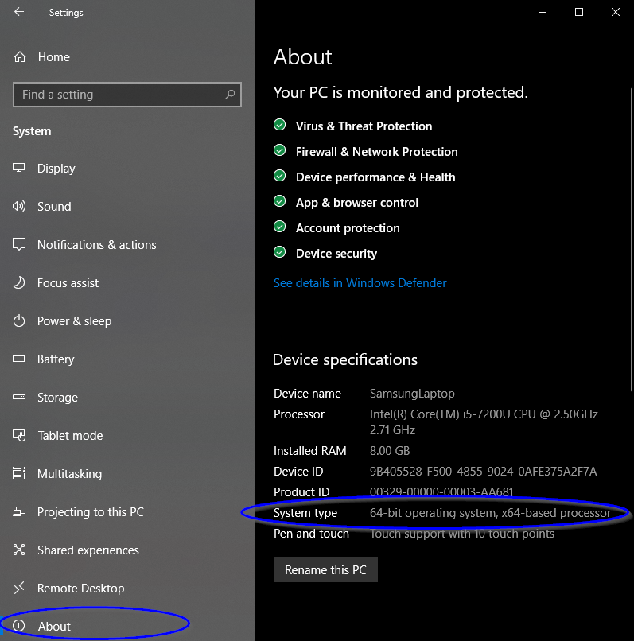

This post details the setup and use of [**latexdiff**](https://ctan.org/pkg/latexdiff?lang=en) and [**latexpand**](https://ctan.org/pkg/latexpand?lang=en) for tracking revisions in $\LaTeX$ documents. Revisions are tracked by first flattening $\LaTeX$ documents (with chapters, a reference section, etc.) into a single .tex file, and then comparing the differences between an old.tex file to a new.tex file. Let me know if you notice a typo or have suggestions in the comments below.

# Getting started

Since [**latexdiff**](https://ctan.org/pkg/latexdiff?lang=en) is a [**Perl**](https://www.perl.org/get.html) script, you will need Perl to run it:

1. Download and install the [**Perl**](https://www.perl.org/get.html) programming language. [**Strawberry Perl**](http://strawberryperl.com/) works well on Windows. Mac OS X comes with an installation of Perl.


  + You can check if you are running on a 64 or 32 bit processor by navigating to Windows Settings -> System -> About



2. Download [**latexdiff**](https://ctan.org/pkg/latexdiff?lang=en) from CTAN.

  + Unzip the latexdiff files and copy them to a C:\\Strawberry\\perl\\bin\\latexdiff folder.

3. Download [**latexpand**](https://ctan.org/pkg/latexpand?lang=en) also from CTAN (if you don't already have it). latexpand comes with TexLive and MikTex.

  + I prefer to use the [**TexMaker**](https://www.xm1math.net/texmaker/index.html) $\LaTeX$ editor which comes with MikTex. Hence, I simply checked that I had latexpand with the package manager.
  


4. You're ready to go!

# Using latexdiff and latexpand

Now that you have both latexdiff and latexpand use the below steps to track changes to a $\LaTeX$ document. This process assumes you have the following folder structure on your machine:


1. Copy the most recent version's folder (with all of its interior files), and rename it with today’s date.


2. Rename the new .tex file with today’s date, and delete all other auxiliary files with the old date.


3. Make changes to the new .tex files (e.g., thesis_7_20_2020.tex, your_bibliography.bib, etc.) and save them.

4. Update the old and new .tex file names with the appropriate dates in the following code, and run it in the Perl command line (you can copy and paste it all at once).

```{bash eval = FALSE}
cd C:\Users\YourName\Documents\Thesis\Thesis_07_19_2020

latexpand --expand-bbl Thesis_07_19_2020.bbl Thesis_07_19_2020.tex > Thesis_07_19_2020_flattened.tex

cd ..\Thesis_07_20_2020

latexpand --expand-bbl Thesis_07_20_2020.bbl Thesis_07_20_2020.tex > Thesis_07_20_2020_flattened.tex

latexdiff ..\Thesis_07_19_2020\Thesis_07_19_2020_flattened.tex Thesis_07_20_2020_flattened.tex > Thesis_07_19_2020_diff.tex
```

5. Compile the diff.tex document in your $\LaTeX$ editor to obtain a latexdiff pdf of your work.

Cheers!